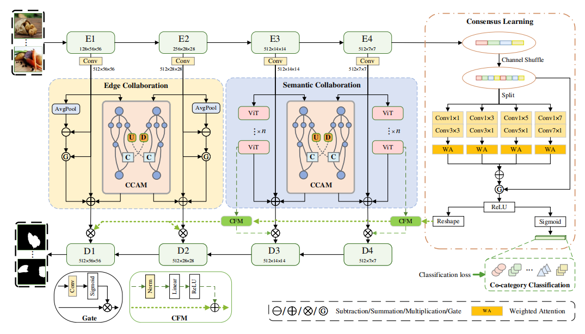

ESCF： Edge and Semantic Collaboration Framework with Cross Coordination Attention for Co-saliency Detection
Created by Qiaohong Chen, Qihang Wang, Xian Fang*, Qi Sun and Jinchao Zhu

In this paper, we propose a novel edge and semantic collaboration framework (ESCF). ESCF employs high-level features to align semantic information from highly activated salient regions, while utilizing low-level features to refine edge contours for improved clarity. To eliminate distracting elements within images, we introduce a cross coordination attention module (CCAM) that calibrates channel weights in each parallel branch using global information. By leveraging interactive learning across various feature layers, the model improves its capacity to capture position sensitive details, effectively minimizing noise in the process. Furthermore, we design a consensus learning module (CLM) that focuses on spatial and channel information across multi-scale features in parallel, allowing it to extract consensus clues from the generated multivariate attention maps, which in turn helps the network infer co-salient targets and ultimately guide it towards accurate predictions. We evaluate our method on three challenging CoSOD benchmark datasets using four widely recognized metrics, and experimental results demonstrate that our approach outperforms existing CoSOD methods.  

\

Prediction results
The co-saliency maps of GCoNet can be found at https://pan.baidu.com/s/1MYyfquXh-t6P7Qh575G5ew?pwd=pfng.
